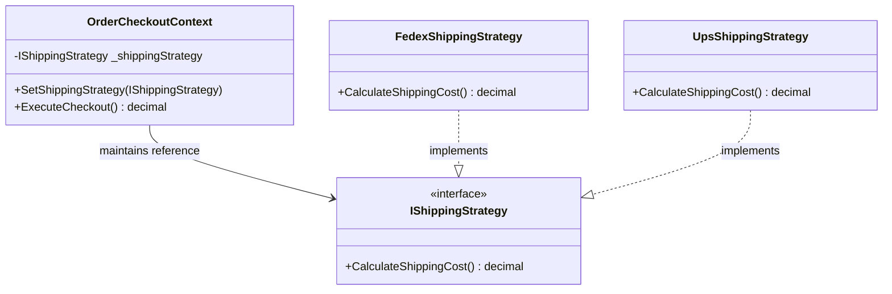
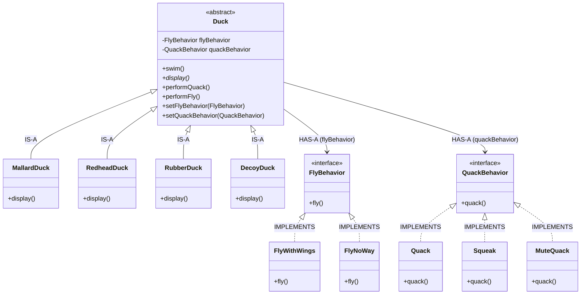

# Strategy Pattern (Behavioral)

### 📌 Implementation Context
This project simulates an E-Commerce checkout component. Instead of using hardcoded conditional structures (`if/switch`) to handle various shipping carriers, the system encapsulates each carrier's pricing logic inside a dedicated strategy class. This allows new carriers to be added without modifying the core checkout engine, adhering strictly to the Open/Closed Principle.

### 📐 Structural Layout
#### Order Checkout Example

---
### DuckUSim

